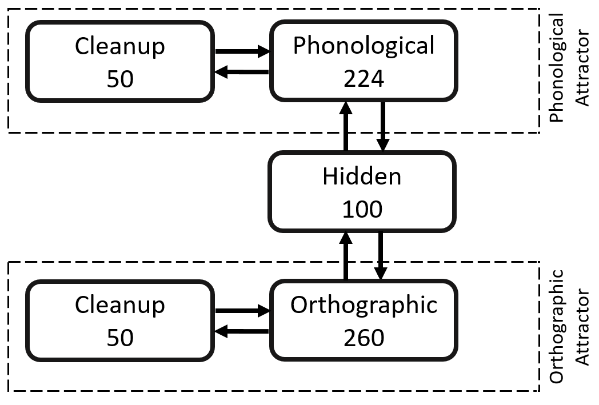

# Bidirectional-PDP
This repo implements our paper:

Lim, O'Brien, & Onnis (submitted), “[Orthography-phonology consistency in English: Theory- and data-driven measures and their impact on auditory vs. visual word recognition](https://osf.io/wdzqc/?view_only=d6ef4592811441779ce7e8801dec805d),” in [journal name].

Please cite our paper if the code is useful for your project.
```
@article{TBD,
  title={Orthography-phonology consistency in English: Theory- and data-driven measures and their impact on auditory vs. visual word recognition},
  author={Lim, Alfred and Onnis, Luca and O'Brien, Beth A},
  journal={TBD},
  volume={TBD},
  number={TBD},
  pages={TBD},
  year={TBD},
  publisher={TBD}
}
```
You may also find our [OSF repository](https://osf.io/wdzqc/?view_only=d6ef4592811441779ce7e8801dec805d) useful.

# Background
This bidirectional Parallel Distributed Processing (PDP) network was trained with either an orthography-phonology or phonology-orthography mapping task, corresponding to reading aloud visually presented words, and spelling spoken words, respectively. Our focus is on the PDP framework developed by [Rumelhart, Hinton, & McClelland (1986)](https://doi.org/10.7551/mitpress/5236.003.0018) that provides natural accounts of the exploitation of multiple, simultaneous, and often mutual constraints. To examine the ease with which the model can generate the target output for a word, we measured the closeness of the model's output to the target by calculating the mean squared error (MSE) that serves as a reflection of how difficult it was for the model to learn the GPC/PGC mappings of each word. 

# Architecture


# First-time users
Acquire Lens from either: (1) [the main site](https://ni.cmu.edu/~plaut/Lens/Manual/index.html); (2) [Plaut's lab website](https://www.cnbc.cmu.edu/~plaut/Resources.html); or (3) [our backup repository](https://github.com/alfred-lim/Lens). 

For the general Lens manual, point your browser at index.html inside the Manual folder visit or, alternatively, visit https://ni.cmu.edu/~plaut/Lens/

# Usage
The model implements a multi-layer neural network from orthography to phonology. The model can be trained in two aspects: training the mapping from orthography to phonology (OP; as configured in ``model_reading.tcl``) and training the mapping from phonology to orthography (PO; as configured in ``model_spelling.tcl``).

In order to run a simulation, put a model file (e.g., model_reading.tcl), and a training/testing examples file (e.g., ``op.txt``; see [./build_examples](build_examples/) for a demonstration on how these examples files can be created) into the same directory.

Refer to our [OSF repository](https://osf.io/wdzqc/?view_only=d6ef4592811441779ce7e8801dec805d) for definition of phonological representations of phonemes.

## Required files
* Model file (e.g., ``model_reading.tcl``, ``model_spelling.tcl``)
* Examples file that contains training/testing data (e.g., ``op.ex``, ``po.ex``)

## Training data
Training data is selected from the example file (e.g., ``op.ex``) on the fly. Model files are configured to select examples based on their given frequency (as indicated in ``op.ex`` and ``po.ex``). 

## Testing data
Testing data includes all examples in the example file (e.g., ``op.ex``) with their frequency ignored. All examples will be tested by default.

## Shell commands (for Lens console)
### Start training
Execute 1 training epoch:
```c
trainParallel2 1
```

Execute 500 training epochs:
```c
trainParallel2 500
```

### Stop training
```c
set stop 1
```

### Start testing
This runs the network (without adjusting the weights) on examples in the testing set and accumulates the overall error. If there is no testing set, the training set is used. 
By default, a small report is printed to the terminal.
```c
test
```

# Utilities
+ [`build_examples`](build_examples/) contains a Python file that can be used to build Lens examples files.
+ `create_orth_vectors` contains Python files that create binary orthographic vectors of words to be used in neural networks.
+ `create_phon_vectors` contains Python files that create binary phonological vectors of words to be used in neural networks.

