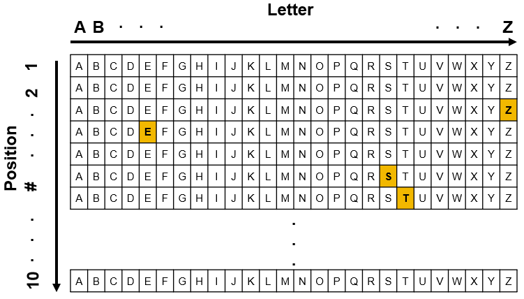

# Create orthographic vectors

This file documents use of create_orth_vectors.py for the purpose of creating binary orthographic vectors of words to be used in neural networks. 

# Coding scheme
We used a position sensitive slot-based vowel-centered format for both orthographic representation (e.g., Harm & Seidenberg, 1999, 2004).

The orthographic layer comprises of 260 units, corresponding to 10 letter position slots × 26 possible letters. Words are coded as vowel-centred, such that the fourth slot was filled with the left-most vowel of a word (e.g., yap → _ _ y a p _ _ _ _ _ )



# Usage
First, use the Python script [create_orth_slots.py](create_orth_slots.py) create_orth_slots.py to convert words to slot-based orthographic representations. This will add a new _OrthSlot_ column to the corpus Excel file.

Then, use the Python script create_orth_vectors.py to convert slot-based orthograhic representations to binary vectors. This will add a new _OrthVector_ column to the corpus Excel file.

## Required files
* Python files (create_orth_slots.py, create_orth_vector.py)
* Corpus file (corpus.xlsx)

### Build OP and PO files
```python
# Read word list
data = pd.read_excel('corpus.xlsx',na_values='',keep_default_na=False)

# Create empty example files
op_file = open('OP.ex','wb') #OP example file
po_file = open('PO.ex','wb') #PO example file

# Call function to write examples
write_examples(data, op_file, po_file)

# Close files
op_file.close()
po_file.close()
```

## Details of steps from Moby/CoCa to MikeNet OtoP Dictionary
1. Read from Moby pronunciator and make some replacements in the phones.
   These replacements include:
   1. Delete the glide '/-/' after the vowel '/aI/'. This mostly
      occurs before /r/, as in 'fire'.
   2. Replace '/-/' with '/@/'. Moby uses /-/ to flag syllabic liquid
      consonants as in 'battle' or 'butter'. We replace these with
      straight up schwa-C sequences to conform to phonological
      inventory of our mikenet simulations.
   3. Replace '/hw/' with 'w'. The voiceless glide is not available in
      our current mikenet inventory, and is not contrastive in
      stereotypical American English.
   4. Replace 'R' with 'r'.
   5. Replace '/(@)/' and '/[@]/' with '/@/'.
   6. Remove words containing phone '/x/' (Bach, loch).

2. Read modified Moby lexicon after 1) and select only those words
   having at most 1 vowel (1 syllable).  The results are stored in
   subMobypron\_dict.csv.

3. Read Coca database and select words having at most 8 letters. There
   are two result CSV files based on different Coca database:
   subCoca\_dict1.csv is based on the lemma words' frequencies;
   subCoca\_dict2.csv is based on real word forms' frequencies;

4. Remove slashes from Moby pronunciations. Also replace digraph
   (polygraph) symbols with monographs. Replacements includes:
   1. For consonants and simple vowels;
	  * consonants:
		* '/tS/'->'C'
		* '/dZ/'->'J'
		* '/S/'->'S'
		* '/T/'->'T'
		* '/D/'->'D'
		* '/Z/'->'B'
		* '/N/'->'G'

	  * simple vowels:
		* '/i/'->'i'
		* '/I/'->'I'
		* '/E/'->'E'
		* '/&/'->'@'
		* '/A/'->'a'
		* '/O/'->'a'
		* '/(@)/'->'E'
		* '/oU/'->'o'
		* '/U/'->'U'
		* '/u/'->'u'
		* '/@/'->'^'

   2. Separate diphthongs into single phone into two phone sequence
      consisting of a simple vowel plus consonantal glide:
	  * '/eI/'->'e/j'
	  * '/aI/'->'a/j'
	  * '/Oi/'->'o/j'
	  * '/AU/'->'a/w'

   Results are stored respectively in extwords1.csv (based on subCoca\_dict1.csv)
   and extwords2.csv (based on subCoca\_dict2.csv)

   In extword1.csv and extword2.csv, column 'wordform' is word form,
   column 'sum\_freq' is word frequency in Coca, column 'norm\_freq'
   is normalized frequency per million (dividing 'sum\_freq' by 450),
   column 'Moby\_pron' is Moby pronunciation of the word, column
   'Rep\_P' is phonological representation of the word, column
   'Rep\_O' is orthographical representation of the word, '/'
   separates phonemes or letters.  In extword2.csv, column
   'word\_class' is class type of each word.

5. Create extword3.csv based on extword2.csv, by summing up the same
   word form's frequencies across all word types.

6. Generate training example files based on extword1.csv, extword2.csv
   and extword3.csv, the results are: trainexp\_full1.txt,
   trainexp\_full2.txt, and trainexp\_full3.txt
