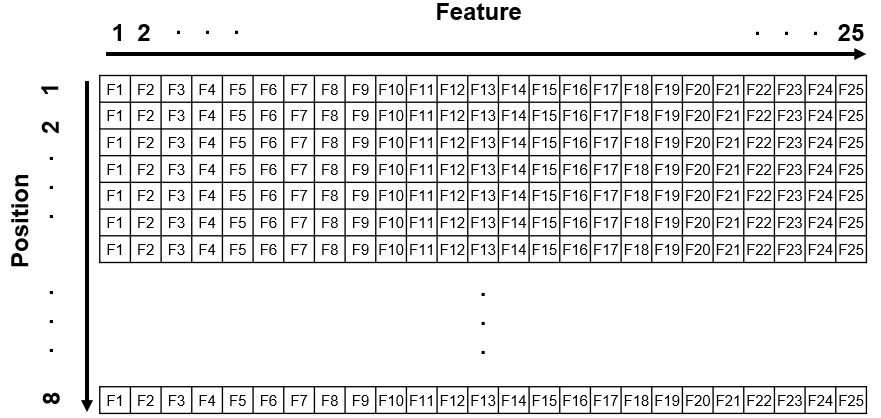

# Create phonological vectors

This file documents use of ``create_phon_slots.py`` and ``create_phon_vectors.py`` for the purpose of creating binary orthographic vectors of words to be used in neural networks. 

# Coding scheme
We used a position sensitive slot-based vowel-centered format for phonological representation (e.g., Harm & Seidenberg, 1999, 2004).

A word’s phonology was represented with nodes coding phoneme features (8 phoneme position slots × 28 possible phonological features = 224 units). Each phoneme was encoded by a binary vector of 28 phonological features (e.g., anterior, approximant, back, consonantal, etc.) taken from PHOIBLE (Moran & McCloy, 2019), an online repository of cross-lingual phonological data. The value of 1 represented the presence of that feature and 0 represented its absence. 

A list of phonemes and their respective phonological features used in the present work can be found in the Open Science Framework (OSF) repository for this project



## Example
The word 'zest' → /zEst/

### Slot-based encoding
``_ _ z E s t _ _``

### Binary vector
```
['_', 0, 0, 0, 0, 0, 0, 0, 0, 0, 0, 0, 0, 0, 0, 0, 0, 0, 0, 0, 0, 0, 0, 0, 0, 0, 0, 0, 0]
['_', 0, 0, 0, 0, 0, 0, 0, 0, 0, 0, 0, 0, 0, 0, 0, 0, 0, 0, 0, 0, 0, 0, 0, 0, 0, 0, 0, 0]
['z', 1, 0, 0, 1, 0, 1, 1, 1, 0, 0, 0, 0, 0, 0, 0, 0, 0, 0, 1, 0, 0, 0, 1, 0, 0, 0, 0, 0]
['E', 0, 1, 0, 0, 0, 1, 0, 0, 0, 1, 1, 0, 0, 0, 0, 0, 0, 0, 1, 0, 1, 0, 0, 1, 0, 0, 0, 0]
['s', 1, 0, 0, 1, 0, 1, 1, 1, 0, 0, 0, 0, 0, 0, 0, 0, 0, 0, 0, 0, 0, 0, 1, 0, 0, 0, 0, 0]
['t', 1, 0, 0, 1, 0, 0, 1, 0, 0, 0, 0, 0, 0, 0, 0, 0, 0, 0, 0, 0, 0, 1, 0, 0, 0, 0, 0, 0]
['_', 0, 0, 0, 0, 0, 0, 0, 0, 0, 0, 0, 0, 0, 0, 0, 0, 0, 0, 0, 0, 0, 0, 0, 0, 0, 0, 0, 0]
['_', 0, 0, 0, 0, 0, 0, 0, 0, 0, 0, 0, 0, 0, 0, 0, 0, 0, 0, 0, 0, 0, 0, 0, 0, 0, 0, 0, 0]
```

# Usage
First, use the Python script [create_phon_slots.py](create_phon_slots.py) to convert words to slot-based phonological representations. This will add a new _PhonSlot_ column to the corpus Excel file.

Then, use the Python script [create_phon_vectors.py](create_phon_vectors.py) to convert slot-based phonological representations to binary vectors. This will add a new _PhonVector_ column to the corpus Excel file.

## Required files
* Python files (``create_phon_slots.py``, ``create_phon_vector.py``)
* Corpus file (e.g., ``corpus.xlsx``)
* List of phonological features (e.g., ``phonological_features.xlsx``)

If you need a sample corpus file or list of phonological features, you may find our [OSF repository](https://osf.io/wdzqc/?view_only=d6ef4592811441779ce7e8801dec805d) useful.
